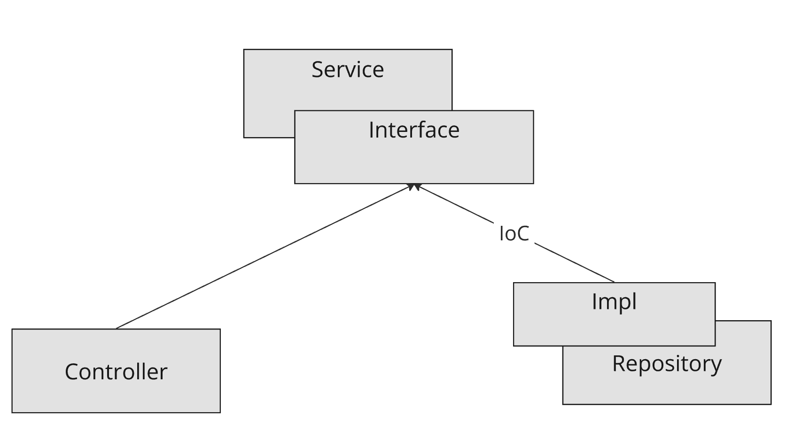

# Connectivity Service Backend

[Hosted on GitHub](https://github.com/Connectivity-Service-Development/backend-service)

Request access [email](mailto:davgustis@gem.cz)
## Local build

**Docker** and **Java 21** are required.

`./gradlew clean buld`

## Local Run

Postgres is required. Run app with profile name `local`. Configure DB
per [application-local.properties](src/main/resources/application-local.properties)

One command setup using docker:

`docker run -d \
  --name connectivity-postgres \
  -e POSTGRES_DB=connectivity \
  -e POSTGRES_USER=postgres \
  -e POSTGRES_PASSWORD=mysecretpassword \
  -p 5432:5432 \
  postgres:16`

Run using Gradle:

`./gradlew bootRun --args='--spring.profiles.active=local'`

To test go to:

http://localhost:8080/swagger/swagger-ui/index.html

## Tests and documentation

Each use case is covered by integration tests. App uses `test containers`, **Docker** is required.

Tests also serve a purpose for developers as documentation. Can be used to guide through the application logic.

## API Documentation

Api spec is described using OpenAPI:
https://backend-service-7snj9.ondigitalocean.app/swagger/swagger-ui/index.html

## CI/CD

[GitHub Actions](https://github.com/Connectivity-Service-Development/backend-service/actions)

### Dev

Pipeline is triggered either manually or automatically on push to develop branch.

It builds docker image and pushes it to Digital Ocean container registry.

The app is deployed using App Platform. When docker image is updated, it is automatically deployed.

https://cloud.digitalocean.com/apps/68f5b2b2-f3b1-4a89-89be-557184ad6676?i=55ae0c

### Prod

Pipeline is triggered automatically on git tag.

It builds docker image and pushes it to Digital Ocean production container registry.

The app is deployed using App Platform. When docker image is updated, it is automatically deployed.

### DEV DEPLOYMENT

https://backend-service-7snj9.ondigitalocean.app/actuator/info

### PROD DEPLOYMENT

https://connectivityserviceprod-r9do8.ondigitalocean.app/swagger/swagger-ui/index.html

## Monitoring

Application exposes prometheus endpoints. Metrics from /api/** services are collected and displayed in Grafana.

https://grafana.gemsystem.cz/d/de1uect7vxh4wc/api?orgId=30

## Feature-Based Architecture Following IoC Principle

In the application, a **feature-based architecture** is implemented, where each feature (e.g., prepaid services) has its
own package structure. The design follows the **Inversion of Control (IoC)** principle, ensuring that the layers are
decoupled:

- **Service Layer**: The core of the architecture, containing business logic. It is abstracted and unaware of other
  layers (controllers or repositories).
- **Controller Layer**: Handles incoming HTTP requests, depends on the service layer to process data and send responses.
- **Repository Layer**: Interfaces with the database, only depends on the service layer for interactions.

Each layer has a clear responsibility:

- **Service Layer** acts as the central component where business rules are defined.
- **Controllers** depend on services to perform operations.
- **Repositories** provide data access to services.

### Architecture Diagram

The diagram below illustrates how the components interact. Each feature has its own:

- **Controller**: e.g., `PrepaidServiceController`
- **Service**: e.g., `UserServiceManager`
- **Repository**: e.g., `UserPrepaidServiceProlongationImpl`

